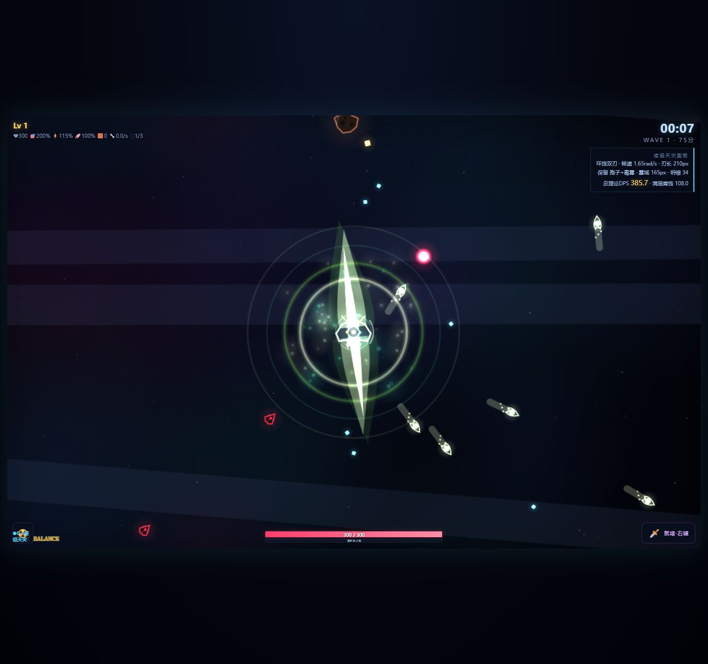

# 星火战机 Starfall

一款运行在浏览器中的霓虹风 2D Roguelite 射击游戏原型。项目使用原生 JavaScript 与 Canvas 2D 实现，重点探索分支武器进化、组合攻击、阵型出怪和多阶段 Boss 战。



## 当前能力

- 鼠标、触屏与 WASD 移动，自动攻击与主动清弹幕技能。
- 蜂窝式技能树和可叠加的攻击进化，而非简单替换旧攻击。
- 标准化攻击描述，覆盖弹体、范围、环绕、主动瞄准与持续伤害等行为。
- 普通敌人、阵型、生成上限和预警机制。
- 龙 Boss 的盘旋突击、身体碰撞区、身体弹幕和三阶段吐息。
- `actual` 与 `test` 两套数值配置，方便正常游玩和快速调试。
- 无构建步骤、无后端依赖，可由任意静态文件服务器运行。

> 当前状态：可玩的开发版原型。完整胜利结算、中期 Boss、音效和全部武器分支仍在开发中。

## 本地运行

直接打开 `index.html` 可以运行大部分功能。推荐通过本地静态服务器启动，以避免浏览器对资源加载的限制：

```bash
python -m http.server 8765
```

然后访问：

```text
http://127.0.0.1:8765/
```

常用调试地址：

```text
http://127.0.0.1:8765/?balance=test
http://127.0.0.1:8765/?balance=test&debug=boss
http://127.0.0.1:8765/?balance=test&debugForm=plague
```

## 测试

项目测试使用 Node.js 内置能力，不需要安装 npm 依赖：

```bash
node tests/balance-smoke.mjs
node tests/balance-profiles-smoke.mjs
node tests/projectile-art-smoke.mjs
node tests/archetype-art-smoke.mjs
node tests/dragon-motion-smoke.mjs
node tests/attack-framework-smoke.mjs
node tests/systems-v23-smoke.mjs
```

## 项目结构

```text
assets/       游戏位图与龙精灵图资源
dev/          美术预览、调试页面与验证截图
js/           游戏循环、实体、攻击、出怪、UI 和特效
tests/        数值、攻击、Boss 与美术契约测试
index.html    游戏入口
style.css     页面与 UI 样式
```

设计和数值说明见：

- [DESIGN.md](DESIGN.md)
- [BALANCE.md](BALANCE.md)
- [BULLETS.md](BULLETS.md)
- [MONSTERS.md](MONSTERS.md)

## 后续计划

1. 清理不可达的旧升级与融合逻辑，统一技能树和攻击配置来源。
2. 拆分游戏循环、实体、成长、出怪和 Boss 职责。
3. 增加中期 Boss、胜利结算与完整 6–8 分钟通关闭环。
4. 补齐音效、设置、引导和浏览器端完整流程测试。

